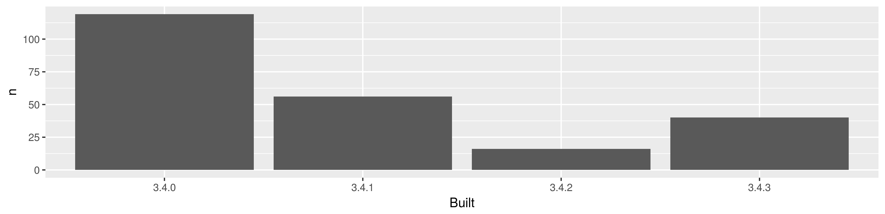

<!-- README.md is generated from README.Rmd. Please edit that file -->
packages-report
===============

Workshop challenge checklist
----------------------------

*As you complete tasks, you can ~~cross them out~~ by surrounding with `~~`.*

-   Have a look around the files here. Where are the R scripts? What are the directories `data` and `figs` for?
-   Notice that this README is an `.Rmd` file. That means it could contain R code and will need to be rendered to create `README.md`.
-   ~~Open [R/01\_write-installed-packages.R](R/01_write-installed-packages.R). Write the script as directed. Run it. Commit and push the current state.~~
-   ~~Open [R/02\_wrangle-packages.R](R/02_wrangle-packages.R). Fill in the missing pieces of the script as directed. Run it. Commit and push the current state.~~
-   ~~Open [R/03\_barchart-packages-built.R](R/03_barchart-packages-built.R). Fill in the missing pieces of the script as directed. Run it. Commit and push the current state.~~
-   ~~Fill in the blanks below in this README, using the results stored elsewhere.~~
-   If you get this far, write an R script to run the whole analysis and, perhaps, another script that does a `make clean` style reset.

Overview
--------

The goal of packages-report is to FINISH THIS SENTENCE.

I have `231` add-on packages installed.

Here's how they break down in terms of which version of R they were built under, which is related to how recently they were updated on CRAN.

<table style="width:32%;">
<colgroup>
<col width="11%" />
<col width="8%" />
<col width="12%" />
</colgroup>
<thead>
<tr class="header">
<th align="center">Built</th>
<th align="center">n</th>
<th align="center">prop</th>
</tr>
</thead>
<tbody>
<tr class="odd">
<td align="center">3.4.0</td>
<td align="center">119</td>
<td align="center">0.5152</td>
</tr>
<tr class="even">
<td align="center">3.4.1</td>
<td align="center">56</td>
<td align="center">0.2424</td>
</tr>
<tr class="odd">
<td align="center">3.4.2</td>
<td align="center">16</td>
<td align="center">0.06926</td>
</tr>
<tr class="even">
<td align="center">3.4.3</td>
<td align="center">40</td>
<td align="center">0.1732</td>
</tr>
</tbody>
</table>

### Flow of the analysis

*If you have time, document the analysis works, using internal links.*
